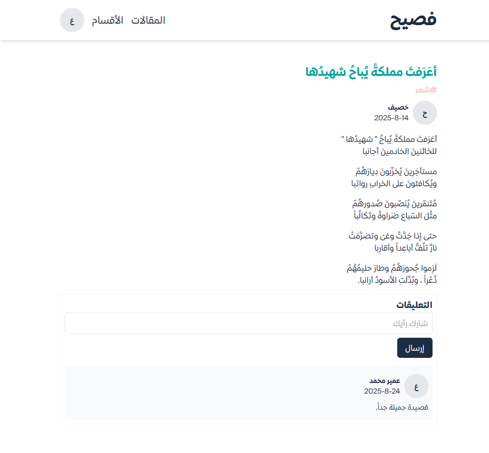

# فصيح (Fasi7)

**Fasi7** is an online community and platform dedicated to lovers of the Arabic language.  
It provides a space where members can share knowledge, discuss literature, improve their language skills, and preserve the beauty of Arabic in the digital age.

---

## 🛠️ Tech Stack

- **Frontend:** Next.js (React), Tailwind CSS
- **Backend:** Supabase
- **Authentication:** Supabase Auth

---

## 🌐 Live Demo (Note)

A live demo of Fasi7 may be available at [https://fasi7-tau.vercel.app/](https://fasi7-tau.vercel.app/),  
but the backend is hosted on Supabase free tier.  
If the site is inactive for a week, Supabase may pause the project,  
so the demo might not be accessible until the backend is resumed.

---

## 📷 Screenshots

### Home / Landing Page

_Explore latest discussions and featured sections._

### Login / Signup

_Sign in or register to join the Fasi7 community._

### All Posts Page

_Browse all posts from different sections._

### Section's Posts Page

_View posts specific to a selected section._

### Create a Post

_Write and publish your own post._

### Post Page

_Read posts, comment, and interact with others._

### Profile Page

_View and edit your profile, see your posts and activity._
